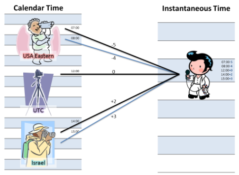

Chapter 2-Single Table Queries
==============================

```SQL
SELECT empid, YEAR(orderdate) AS orderyear, COUNT(*) AS numorders
FROM Sales.Orders
WHERE custid = 71
GROUP BY empid, YEAR(orderdate)
HAVING COUNT(*) > 1
ORDER BY empid, orderyear;
```

   | empid | orderyear | numorders |  
1  |   1	 |   2007	   |    2      |
2  |   1	 |   2008    |    3      |
3  |   2   |   2008    |    2      |                        
4  |   3   |   2007    |    2      |
5  |   4   |   2008    |    3      | 
6  |   5   |   2007    |    3      | 
7  |   6   |   2007    |    3      | 
8  |   7   |   2008    |    2      | 
9  |   8   |   2007    |    4      | 
 

Even though the `SELECT` clause appears first in the query, it is logically processed almost last. The clauses are logically processed in the following order:
-----------------------
■ FROM
■ WHERE
■ GROUP BY
■ HAVING
■ SELECT
  • Expressions
  • DISTINCT
■ ORDER BY
  • Top/OFFSET-FETCH
-----------------------


So even though syntactically the sample query starts with a SELECT clause, logically its clauses are processed in the following order:

```SQL
FROM Sales.Orders
WHERE custid = 71
GROUP BY empid, YEAR(orderdate)
HAVING COUNT(*) > 1  
SELECT empid, YEAR(orderdate) AS orderyear, COUNT(*) AS numorders
ORDER BY empid, orderyear
```

#### The GROUP BY Clause

```SQL
FROM Sales.Orders
WHERE custid = 71
GROUP BY empid, YEAR(orderdate)
```
The `WHERE` phase returned 31 rows, within which there are 16 unique combinations of employee ID and order year values, as shown here:

   | empid | YEAR(orderdate) |     
1  |   1	  |     2006	     |
2  |   1	  |     2007       |
3  |   1   |     2008        |                        
4  |   2   |     2006        | 
5  |   2   |     2007        | 
6  |   2   |     2008        | 
7  |   3   |     2007        | 
8  |   4   |     2007        | 
...|  ...  |     ...         | 
16 |   9   |     2006        | 

**If the query involves grouping, all phases subsequent to the `GROUP BY` phase, including `HAVING`, `SELECT`, and `ORDER BY`- must operate on groups as opposed to operating on individual rows.** Each group is ultimately represented by a single row in the final result of the query. This implies that all expressions that you specify in clauses that are processed in phases subsequent to the GROUP BY phase are required to guarantee returning a single value per group.

**Elements that do not participate in the `GROUP BY` list are allowed only as inputs to an aggregate function** such as `COUNT`, `SUM`, `AVG`, `MIN`, or `MAX`. For example, the following query returns the total freight and number of orders per each employee and order year:

```SQL
SELECT empid, YEAR(orderdate) AS orderyear, SUM(freight) AS totalfreight, COUNT(*) AS numorders
FROM Sales.Orders
WHERE custid = 71
GROUP BY empid, YEAR(orderdate);
```
   | empid | orderyear | totalfreight | numorders |  
1  |   1	 |   2006	  |    126.56     |     1     |
2  |   2	 |   2007    |     89.16    |     1     |
3  |   9   |   2008    |    214.27    |     1     |                       
4  |   1   |   2006    |       ...    |     2     |
5  |   2   |   2007    |       ...    |     1     |
6  |   3   |   2008    |       ...    |     2     | 
7  |   4   |   2007    |       ...    |     1     | 
8  |   5   |   2007    |       ...    |     3     | 
...|  ...  |   ...     |       ...    |    ...    | 
16 |   7   |   2006    |    1231.56   |     2     | 

The function `COUNT(*)` returns **the count of rows in each group**.

**Note that all aggregate functions ignore NULL marks with one exception, `COUNT(*)`**. For example, consider a group of five rows with the values "30, 10, NULL, 10, 10" in a column called *qty*:

The expession `COUNT(*)` would return 5 because there are five rows in the group, whereas `COUNT(qty) `would return 4 because there are four **known** values.

`COUNT(DISTINCT qty)` would return 2.

Let's look at an usage of `DISTINCT`:

```SQL
SELECT
   empid,
   YEAR(orderdate) AS orderyear,
   COUNT(DISTINCT custid) AS numofcust
FROM Sales.Orders
GROUP BY empid, YEAR(orderdate);

/*
   | empid | orderyear | numofcust | 
1  |   1	 |   2006	   |     22    |
2  |   2	 |   2006    |     15    |
...|  ...  |   ...     |     ...   | 
27 |   9	 |   2008    |     16    |
*/
```

## The HAVING Clause

With the Having clause, you can specify a predicate to filter groups (as opposed to filtering indivudual rows which happens in the WHERE clause). Groups for which the logical expression evaluates to FALSE or UNKNOWN are filtered out, only TRUE will reach to the next logical query processing phase:

```SQL
SELECT empid, YEAR(orderdate) AS orderyear
FROM Sales.Orders
WHERE custid = 71
GROUP BY empid, YEAR(orderdate)
HAVING COUNT(*) > 1;  -- filter group, not individual
```

## The SELECT Clause

Remember that the SELECT clause is processed after the FROM, WHERE, GROUP BY, and HAVING clauses. This means that aliases assigned to expressions in the SELECT clause do not exist as far as clauses that are processed before the SELECT clause are concerned. Below is a typical **mistake**:

```SQL
-- invalid query
SELECT orderid, YEAR(orderdate) AS orderyear
FROM Sales.Orders
WHERE orderyear > 2006;
-- produce an error "Invalid column name 'orderyear'"
```
One way around this problem is to repeat the expression YEAR(orderdate) in both the WHERE and the SELECT clauses:

```sql
SELECT orderid, YEAR(orderdate) AS orderyear
FROM Sales.Orders
WHERE YEAR(orderdate) > 2006;
```
note that SQL Server is capable of identifying the repeated use of the same expression—`YEAR(orderdate)`—in the query. The expression only needs to be evaluated or calculated once.

Within the SELECT clause, you are still not allowed to refer to a column alias that was created in the same SELECT clause, regardless of whether the expression that assigns the alias appears to the left or right of the expression that attempts to refer to it:

```sql
-- invalid query
SELECT orderid,
 YEAR(orderdate) AS orderyear,
  orderyear + 1 AS nextyear
FROM Sales.Orders;

-- correct query
SELECT orderid,
 YEAR(orderdate) AS orderyear,
 YEAR(orderdate) + 1 AS nextyear  -- again, SQL Server will only evaluate YEAR(orderdate) once
FROM Sales.Orders;
```

It is quite common for a SELECT query to return duplicated records if you don't include the key in the SELECT clause:
```SQL
SELECT empid, YEAR(orderdate) AS orderyear
FROM Sales.Orders
WHERE custid = 71;

/*
empid        orderyear
----------- -----------
9              2006
1              2006
2              2006
4              2007
8              2007
6              2007
6              2007
8              2007
5              2007
...            ...
1              2008 

(31 row(s) affected)
*/
```

SQL provides the means to guarantee uniqueness in the result of a SELECT statement in the form of a `DISTINCT` clause that removes duplicate rows:

```SQL
SELECT DISTINCT empid, YEAR(orderdate) AS orderyear
FROM Sales.Orders
WHERE custid = 71;
/*
empid        orderyear
----------- -----------
1              2006
1              2007
1              2008
...             ...
9              2006 

(16 row(s) affected)
*/
```

## The ORDER BY Clause

```SQL
SELECT empid, YEAR(orderdate) AS orderyear, COUNT(*) AS numorders
FROM Sales.Orders
WHERE custid = 71
GROUP BY empid, YEAR(orderdate)
HAVING COUNT(*) > 1
ORDER BY empid, orderyear;  -- you can use alias in the SELECT clause
```

One of the most important points to understand about SQL is that a table has no guaranteed order, because a table is supposed to represent a set (or multiset, if it has duplicates), and a set has no order. This means that when you query a table without specifying an ORDER BY clause, the query returns a table result, and SQL Server is free to return the rows in the output in any order. The only way for you to guarantee that the rows in the result are sorted is to explicitly specify an ORDER BY clause.

However, if you do specify an ORDER BY clause, the result cannot qualify as a table, because the order of the rows in the result is guaranteed. A query with an ORDER BY clause results in what standard SQL calls a **cursor**, a nonrelational result with order guaranteed among rows. You're probably wondering why it matters whether a query returns a table result or a cursor. Some language elements and operations in SQL expect to work with table results of queries and not with cursors, examples include table expressions and set operators, which is covered in details in later chapters.

Notice that the ORDER BY clause refers to the column alias orderyear, which was created in the SELECT phase. **The ORDER BY phase is in fact the only phase in which you can refer to column aliases created in the SELECT phase**, because it is the only phase that is processed after the SELECT phase.

T-SQL allows you to specify elements in the ORDER BY clause that do not appear in the SELECT clause, meaning that you can sort by something that you don’t necessarily want to return in the output. The reasoning behind this restriction is that when DISTINCT is specified, a single result row might represent multiple source rows; therefore, it might not be clear which of the multiple possible values in the ORDER BY expression should be used. Consider the following invalid
query:

```SQL
SELECT DISTINCT country
FROM HR.Employees
ORDER BY empid;
```
There are nine employees in the Employees table—five from the United States and four from the United Kingdom. If you omit the invalid ORDER BY clause from this query, you get two rows back— one for each distinct country. Because each country appears in multiple rows in the source table, which specific row's empid should be used to sort the result?


## The TOP Filter

```SQL
SELECT TOP (5) orderid, orderdate, custid, empid
FROM Sales.Orders
ORDER BY orderdate DESC;

SELECT TOP (1) PERCENT orderid, orderdate, custid, empid
FROM Sales.Orders
ORDER BY orderdate DESC;
```
Even though `Top` filter appear in the select clause, but it is evaluated after select clause and also after `ORDER BY`, because it relies on Order BY to ifve it its filtering-related meaning. So if `Distinct` is sepcified in the SELECT clause, the TOP filter is evaulated after duplicate rows have been removed.

Note that the queries above is not deterministic, for example, you might have 6 records and 2 records have the most late same date. in this case, you have to add a tiebreaker:

```SQL
SELECT TOP (5) orderid, orderdate, custid, empid
FROM Sales.Orders
ORDER BY orderdate DESC, orderid DESC;  -- add one more tiebreaker `orderid`
```
or you can request to return all ties:

```SQL
SELECT TOP(5) WITH TIES orderid, orderdate, custid, empid
FROM Sales.Orders
ORDER BY orderdate DESC;

/*
   | orderid |  orderdate                | custid | empid |
1  |  11077	 |  2008-05-06 00:00:00.000  |   65   |   1   |
2  |  11076	 |  2008-05-06 00:00:00.000  |    9   |   4   |
3  |  11075	 |  2008-05-06 00:00:00.000  |   68   |   8   |
4  |  11074	 |  2008-05-06 00:00:00.000  |   73   |   7   |
5  |  11073	 |  2008-05-05 00:00:00.000  |   58   |   2   |
6  |  11072	 |  2008-05-05 00:00:00.000  |   20   |   4   |   -- add by TIES
7  |  11071	 |  2008-05-05 00:00:00.000  |   46   |   1   |   -- add by TIES
8  |  11070	 |  2008-05-05 00:00:00.000  |   44   |   2   |   -- add by TIES

(8 row(s) affected)
*/
```
Notice that the output has 8 rows, even though you specified `TOP (5)`

## The OFFSET-FETCH Filter

The Top option is has two shortcoming:

1. it is not standard 
2. it doesn't support skipping capabilities

Standard SQL defines a TOP-like filter called `OFFSET-FETCH` that does support skipping capabilities, and this makes it very useful for ad-hoc paging purposes.

The OFFSET-FETCH filter is considered part of the `ORDER BY` clause, which normally serves a presentation ordering purpose.

The Syntax is:

```SQL
ORDER BY column_list [ASC |DESC]       -- ORDER BY is mandatory for OFFSET-FETCH
OFFSET offset_row_count {ROW | ROWS}   -- OFFSET is also mandatory
FETCH {FIRST | NEXT} fetch_row_count {ROW | ROWS} ONLY  -- ONLY is also mandatory (why not just get rid of this word?)
```

As an example, consider the following query:
```SQL
SELECT orderid, orderdate, custid, empid
FROM Sales.Orders
ORDER BY orderdate, orderid
OFFSET 50 ROWS FETCH NEXT 25 ROWS ONLY
```
Some interesting things to know:

1. the FETCH clause isn't supported without an OFFSET clause. If you do not want to skip any rows but do want to filter with FETCH, you must indicate that by using OFFSET 0 ROWS.

2. OFFSET without FETCH is allowed. In such a case, the query skips the indicated number of rows and returns all remaining rows in the result.

3. The singular and plural forms ROW and ROWS are interchangeable. FIRST and NEXT are interchangeable (if you're not skipping any rows (OFFSET 0 ROWS), you may find the term "first" more suitable than "next").

`OFFSET-FETCH` is more flexible than `TOP` in the sense that it supports skipping capabilities. However, `OFFSET-FETCH` doesn't support `PERCENT` and `WITH TIES`, because OFFSET-FETCH is standard and TOP isn't. So the recommendation is, use `OFFSET-FETCH` as default, use `TOP` when you want to include all ties.


## CASE Expressions

```SQL
SELECT productid, productname, categoryid,
   Case categoryid
     When 1 THEN 'Beverages'
     WHEN 2 THEN 'Condiments'
     WHEN 3 THEN 'Confections'
     ELSE 'Unknown Category'
   END AS categoryname
FROM Production.Products;
```


## NULL Marks

`NULL = NULL` is UNKNOWN, so you can't do

```SQL
--bad sql 
SELECT custid, country, region, city
FROM Sales.Customers
WHERE region = NULL; 

/*
custid       country        region           city
----------- --------------- --------------- ---------------

(0 row(s) affected)
*/
```
instead you do:

```SQL
SELECT custid, country, region, city
FROM Sales.Customers
WHERE region IS NULL;
```


## All-at-Once Operations

SQL Server supports a concept called *all-at-once* operation, which means that all expressions that appear in the same logical query processing phase are evaluated logically at the same point in time. This concept explains why, for example, you cannot refer to column aliases assigned in the SELECT
clause within the same SELECT clause, even if it seems intuitively that you should be able to:

```SQL
-- incorrect
SELECT
  orderid,
  YEAR(orderdate) AS orderyear,
  orderyear + 1 AS nextyear
FROM Sales.Orders;

/*
Msg 207, Level 16, State 1, Line 4
Invalid column name 'orderyear'.
*/
```

SQL Server is free to process the expressions in the WHERE clause in any order. SQL Server usually makes decisions like this based on cost estimations, meaning that typically the expression that is cheaper to evaluate is evaluated first, so you can't assume sql server can do:

```SQL
--incorrect, SQL Server might execute col2/col1 first
SELECT col1, col2
FROM dbo.T1
WHERE col1 <> 0 AND col2/col1 > 2;
```

SQL Server does support short-circuit, example above doesn't work just because of all-at-once operations. 

You have serval ways to avoid a failure here. For example, the order in which the `WHEN` caluses of a `CASE` expression are evaluated is guaranteed. So you could revise the query as:

```SQL
SELECT col1, col2
FROM dbo.T1
WHERE
  CASE
    WHEN col1 = 0 Then 'no'
    WHEN col2/col1 > 2 THEN 'yes'
    ELSE 'no'
  END = 'yes'

-- it is like (CASE .. END) = `yes`
```
the workaround above is quite convoluted. You can use a mathematical workaround as:

```SQL
SELECT col1, col2
FROM dbo.T1 
WHERE (col1 > 0 AND col2 > 2*col1) OR (col1 < 0 AND col2 < 2*col1);
```


## Working with Character Data

this section covers query manipulation of character data, including data types, collation, operators and functions, and pattern matching

#### Data Types

SQL Server supports two kinds of character data types:

1. Regular
   a. `CHAR`
   b. `VARCHAR`
2. Unicode
   a. `NCHAR`
   b. `NVARCHAR`

Regular characters use **one** byte of storage for each character, whereas Unicode data requires **two** bytes per character or **four** bytes when a surrogate pair is needed

## Collation

collation (dictionary meaning) : the act of collecting information together from different sources in order to examine and compare it

Collation is a property of character data that encapsulates several aspects, including language support, sort order, case sensitivity, accent sensitivity and more. To get the set of supported collations and their descriptions, you can query the table function `fn_helpcollations`:

```SQL
-- supported collations
SELECT name, description
FROM sys.fn_helpcollations();

/*
name                             description       
--------------------            ------------------------------
Latin1_General_CI_AS            Latin1-General, case-insensitive, accent-sensitive, kanatype-insensitive, width-insensitive   -- used by default
Latin1_General_BIN              Latin1-General, binary sort
Chinese_PRC_90_CI_AI            Chinese-PRC-90, case-insensitive, accent-insensitive, kanatype-insensitive, width-insensitive
...

5508 row(s)
*/
```
For example, the following list explains the collation Latin1_General_CI_AS:

**Latin1_General**: Code page 1252 is used. (This supports English and German characters, as well as characters used by most Western European countries.)

**Dictionary sorting**: Sorting and comparison of character data are based on dictionary order (A and a < B and b), which is default and if the name contains `BIN` (binary sort), it would mean that sorting and comparison of character data was based on the binary representation of characters (A < B < a < b).

**CI**: The data is case insensitive (a = A).

**AS**: The data is accent sensitive (a <> à, à <> ä)

In an on-premises SQL Server implementation, collation can be defined at four different levels: instance, database, column, and expression. You can explicitly specify a collation for a column as part of its definition by using the COLLATE clause. If you don't, the database collation is assumed by default.

You can convert the collation of an expression by using the `COLLATE` clause. For example, in a case-insensitive environment:
```SQL
SELECT empid, firstname, lastname
FROM HR.Employees
WHERE lastname = N'davis';

/*
empid       firstname  lastname
----------- ---------- --------------------
1           Sara        Davis
*/
```
If you want to stricly compare with case sensitive, then you do:
```SQL
SELECT empid, firstname, lastname
FROM HR.Employees
WHERE lastname Collate Latin1_General_CS_AS = N'davis';
```


## String Concatenation (Plus Sign [+] Operator and CONCAT Function)

Standard SQL dictates that a concatenation with a NULL should yield a NULL. So you can't safely use sth like `SELECT country + N',' + address FROM Company` where address can not null, then the all whole thing will be null even though country is not null. TTo treat a NULL as an empty string—or more accurately, to substitute a NULL with an empty, there is two methods:

1. `COALESCE` function (old fashion)

`COALESCE` return the first that is not NULL:

```SQL
SELECT custid, country, region, city,
  country + COALESCE( N',' + region, N'') + N',' + city AS location  -- region might be null
FROM Sales.Customers;
```

2. `CONCAT` function (most common approach)

`CONCAT` automatically substitutes `NULL` marks with empty strings. For example, `CONCAT('a', NULL, 'b')` returns the string 'ab'

```SQL
SELECT custid, country, region, city,
  CONCAT(country, N',' + region, N',' + city) AS location   -- region might be null
FROM Sales.Customers;
```


## LIKE Predicate and Wildcard

`%` : zero to many 

`_`: exactly one

`[ABC]`:  a **single** character that must be one of the characters specified in the bracket, in this example, it could be `A`, `B` or `C`

`[a-zA-z0-9]`

`^` (not in), for example `^[abc]`


Note that in SQL, there is no `*`, `+` etc wildcards, and no "number" wildcard, so if you want to query something like `XXXABCXXX`you need to do:
 `SELECT ... LIKE %[ABC][ABC][ABC]%`, or use regex


## Date, Time

you can specify a literal (constant) of a datetime as:

```SQL
SELECT orderid, custid, empid, orderdate
FROM Sales.Orders
WHERE orderdate = '20070212';

--SQL Server implicitly converted the character string literal to the column's data type (DATETIME), which is equivalent to: 
SELECT orderid, custid, empid, orderdate
FROM Sales.Orders
WHERE orderdate = CAST('20070212' AS DATETIME);
```

**It is important to note that literal strings like `YYYYMMDD` or `YYYY-MM-DD` are language neutral, while `??/??YYYY` is not**:

```SQL
--using language dependent like SET LANGUAGE is NOT recommended actually, stick to use language neutral literal strings like YYYYMMDD
SET LANGUAGE British;
SELECT CAST('02/12/2007' AS DATETIME);  -- 2007-12-02 00:00:00.000 

SET LANGUAGE us_english;
SELECT CAST('02/12/2007' AS DATETIME);  -- 2007-02-12 00:00:00.000
```
so it is strongly recommended that you phrase your literals in a language-neutral manner. Language-neutral formats are always interpreted by SQL Server the same way and are not affected by language-related settings.

#### Some Common Date, Time related functions

The `DATEADD` Function:

```SQL
SELECT DATEADD(day, 7, '20090212'); 
SELECT DATEADD(month, 12, '20090212'); 
SELECT DATEADD(year, 1, '20090212'); 
--...
```

The `DATEDIFF` Function:
```SQL
SELECT DATEDIFF(day, '20221201', '20221205');    -- 4
SELECT DATEDIFF(month, '20060101', '20080101');  -- 24
SELECT DATEDIFF(year, '20060101', '20080101');   -- 24
```

The `DATENAME` Function:

```SQL
SELECT DATENAME(month, '20090212');  -- February

Select FORMAT(GETDATE(),'MMM')       -- Feb
```

Note that SQL Server doesn't provide build-in function to get only the current system date or only the current system time, the workaround is:
```SQL
SELECT
  CAST(SYSDATETIME() AS DATE) AS [current_date],
  CAST(SYSDATETIME() AS TIME) AS [current_time];
```

## Date and Time Types

Data Type       | Bytes | Accuracy | Recommended Entry Format,                Example
`DATETIME`      |   8   | 3 1/3 ms | `YYYYMMDD hh:mm:ss.nnn`                  20090212 12:30:15.123
`DATETIME2`     |  6-8  |  100ns   | `YYYY-MM-DD hh:mm:ss.nnnnnnn`            2009-02-12 12:30:15.1234567
`DATETIMEOFFSET`|  6-8  |  100ns   | `YYYY-MM-DD hh:mm:ss.nnnnnnn[+|-] hh:mm` 2009-02-12 12:30:15.1234567
`SMALLDATETIME` |   4   |  1 min   | `YYYYMMDD hh:mm`                         20090212 12:30
`Date`          |   3   |  1 day   | `YYYY-MM-DD`                             2009-02-12
`TIME`          |  3-5  |  100ns   | `hh:mm:ss.nnnnnnn`                       12:30:15.1234567

## Date, Time Fucntions Reference

Function            | Return Type | Description 
`GETDATE()`         | `DATETIME`  | Current date and time, can only be used in SQL-Server. If you use GETDATE then you have to port it when you migrate to a different RDBMS
`CURRENT_TIMESTAMP` | `DATETIME`  | Same as `GETDATE` but ANSI SQL–compliant. Note that this is not a function, it is a system define variable I think
`GETUTCDATE()`      | `DATETIME`  | Current date and time in UTC
`GETUTCDATE()`      | `DATETIME2` | Current date and time in `DATETIME2`

Let's look at `DATETIME2` for example, the nanosecond part `nnnnnnn` (maximun 7 of n), which means the default precision is 7 digits.
n* is a zero- to seven-digit number from 0 to 9999999. Storage size rule is:

* 6 bytes for precision less than `nnn`
* 7 bytes for precision `nnn` and `nnnn`
* 8 bytes for all other precision

and the difference between `DATETIME2` and `DATETIMEOFFSET` can be seen from the link below:
https://stackoverflow.com/questions/4331189/datetime-vs-datetimeoffset




## Exercise and Comments

Return United States customers, and for each customer return the total number of orders and total quantities, desired output is:
```s
custid      numorders   totalqty
----------- ----------- -----------
32          11          345
36          5           122
...
89          14          1063

(13 row(s) affected)
```
```SQL
SELECT C.custid, COUNT(DISTINCT O.orderid) AS numorders, SUM(OD.qty) AS totalqty  -- it is a common mistake that not using DISTINCT as `COUNT(O.orderid)`
FROM Sales.Customers AS C
  JOIN Sales.Orders AS O
    ON O.custid = C.custid
  JOIN Sales.OrderDetails AS OD
    ON OD.orderid = O.orderid
WHERE C.country = N'USA'
GROUP BY C.custid;
```


<!-- <div class="alert alert-info p-1" role="alert">
    
</div> -->

<!--  -->

<!-- <code>&lt;T&gt;</code> -->

<!-- <div class="alert alert-info pt-2 pb-0" role="alert">
    <ul class="pl-1">
      <li></li>
      <li></li>
    </ul>  
</div> -->

<!-- <ul>
  <li><b></b></li>
  <li><b></b></li>
  <li><b></b></li>
  <li><b></b></li>
</ul>  -->

<!-- <span style="color:red">hurt</span> -->

<style type="text/css">
.markdown-body {
  max-width: 1800px;
  margin-left: auto;
  margin-right: auto;
}
</style>

<link rel="stylesheet" href="./zCSS/bootstrap.min.css">
<script src="./zCSS/jquery-3.3.1.slim.min.js"></script>
<script src="./zCSS/popper.min.js"></script>
<script src="./zCSS/bootstrap.min.js"></script>